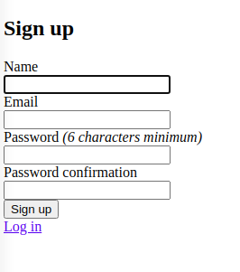
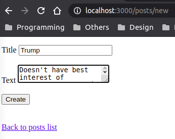
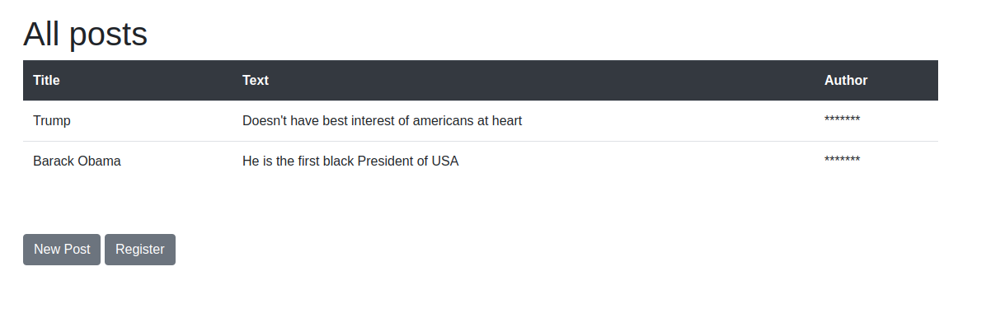
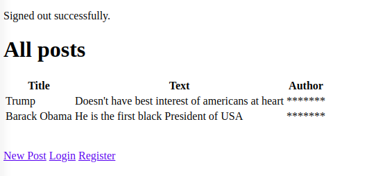

# Members only - Rails
> This project entailed use of devise gem to create a simple authorization app.  Only Signed in users can see authors of  the posts.
## Models created
- User
- Post
## Images

## Built With
- Ruby 2.5.1
- Rails 6.0.2
- Devise 4.7
## Author 1
- Github: [@NiiazalyDzhumaliev](https://github.com/NiiazalyDzhumaliev)
- Twitter: [@Niiazaly1](https://twitter.com/Niiazaly1)
- Linkedin: [Niiazaly Dzhumaliev ](https://www.linkedin.com/in/niiazaly-dzhumaliev-117707132/)
## Author 2
- Github: [@hillarioh](https://github.com/hillarioh)
- Twitter: [@hillaokri](https://twitter.com/hillaokri)
- Linkedin: [@HillaryOkerio](https://www.linkedin.com/in/hillaryokerio/)

## :handshake: Contributing
Contributions, issues and feature requests are welcome!
Feel free to check the [issues page](issues/).
## Show your support
Give a :star:️ if you like this project!